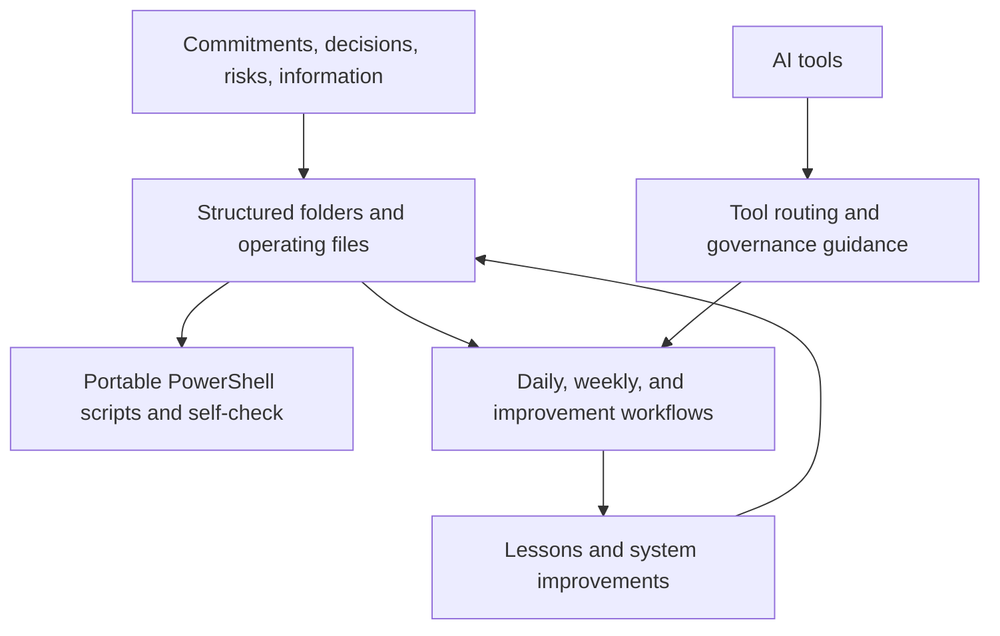

# HELI-OS Architecture

HELI-OS currently exists primarily as a structured operating framework: folders, markdown instructions, PowerShell scripts, AI-tool guidance, and portability checks. It is not yet a finished software platform.

## Current system

The current repository provides structure and repeatable local procedures. It does not contain a calendar engine, email connector, dashboard, or autonomous agent runtime.

## Reference architecture

A future application could add capture, priority, decision, open-loop, review, connector, context, approval, and audit services around the existing operating model. That is reference architecture, not current implementation.

## Boundary

The valuable technical claim today is portable operating design with explicit governance, not software completeness.
